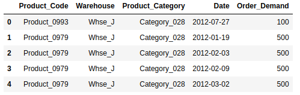
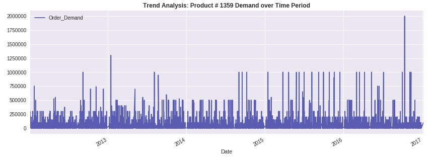
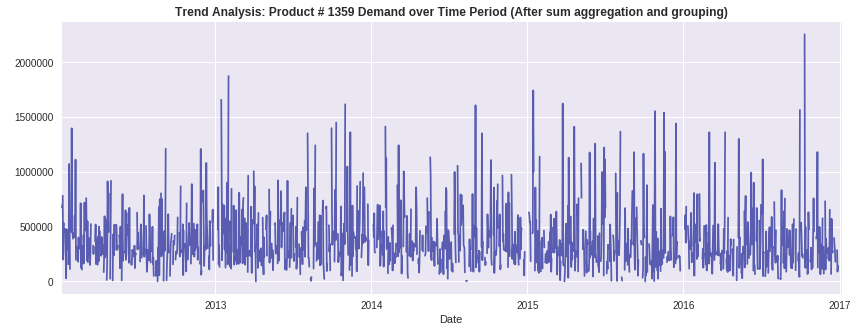
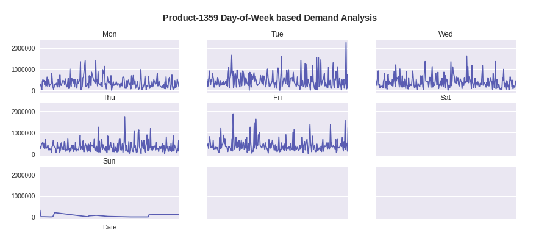
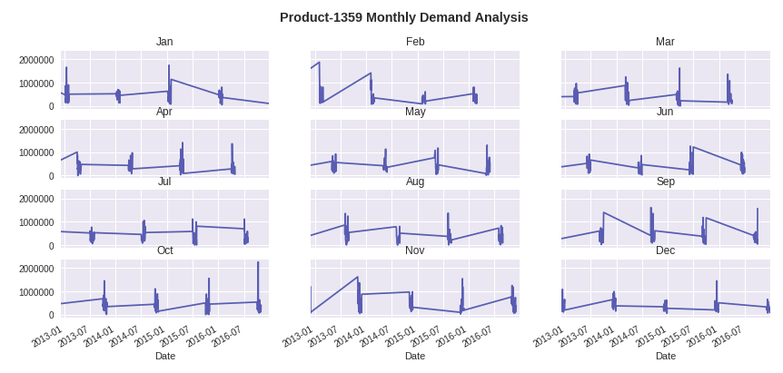
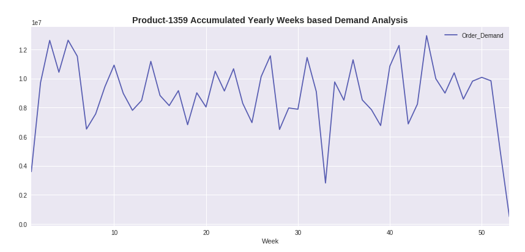
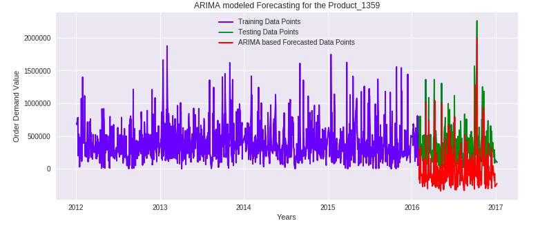

World Wide Products Inc. (Assignment # 05- EECS 731)
==============================

### Quick Note:
If you are interested in only looking at notebook, please access the notebook in **/notebooks/time_series_forecasting.ipynb**.

/notebooks: Contains the notebook of this assignment.

/data: Contains the data csv file (historical_product_demand.csv)

### Objective:

<ul>
<li>Load the given Time series dataset for different products demand information in a Pandas Dataframe</li>
<li>Do feature engineering to analyze the dataset and add value to it in terms of valuable insights</li>
<li>Design the forecasting model to determine the demand for a particular product using the other columns as features</li>
</ul>

### Dataset:

I used the given **Forecasts for Product Demand** dataset (https://www.kaggle.com/felixzhao/productdemandforecasting) for this Demand Forecasting modeling assignment. (Data csv file is in /data/historical_product_demand.csv).

### Process:

<ul>
<li>First, I loaded the given csv file into the Pandas Dataframe.</li>
<li>Then, I did feature engineering and also three time based analysis to get some insights about the given dataset. Please refer to notebook for more details.These three analysis are also given below and are Weekly based, Monthly based and Years Weeks based trends.</li>
<li>Finally, we trained and evaluated (forecasted) using the statistics-based ARIMA (Auto Regressive Integrated Moving Average) model to forecast the product demand.</li>
</ul>

### Discussion and Results:
The given dataset, once loaded into the dataframe, was as follows:

Although we have **2,160** unique products, but to simplify the process, we limit the scope of our forecasting problem by focusing on one **most in-demand top product**. Once we get reasonable forecasting results on it, then we can repeat this process for other products in the given dataset. As from our analysis given in the notebook, we observed that the product **Product_1359** is the top product, so we do forecasting on it. Product # 1359 demand over time graph is as follows:

Since forecasting depends quite heavily on the date feature, so to make sure that all the dates are unique with no duplicates, we grouped the same date values using sum aggregation. So, if product 1359 has 5 rows, all for the same date, then the Order_Demand feature value will be summed up, and 5 rows will be shrunk into just one row entry in the data frame. Then, we again plot and this time it looks more real world and practical for all date index values, as shown in the graph below.

Before proceeding to the time forecast modeling, first analyze or seek some trends in the data. So, we first analyze the **Product # 1359 demand** based on some time unit resolution e.g. **Year, Week, Month, Day**. In other words, we want to see when the **demand (trend) for Product # 1359** is higher and at which time the demand is lower and so on. So for that purpose, first we break the Date/Time field into *new features (Year, Month, Week, Day)*. Folowing are presented three such analysis:

1. **Time Based Analysis on Demand Trend # 01 : Day-of-Week **

2. **Time Based Analysis on Demand Trend # 02 :  Month-of-Year**

3. **Time Based Analysis on Demand Trend # 03 :  Week-of-Year**

From above three time based analysis, we get some interesting trends from the given data, as detailed in our notebook. This can help us in getting valuable insights about this data.

Finally, we modeled our demand forecasting problem for Product # 1359. We used the statistics time-series based **ARIMA** (Auto Regressive Integrated Moving Average) model for our demand forecasting problem. Results are as follows:

The ARIMA model, trained on the (blue bars) data, gives reasonable results (Red bars) as compared to the test data points (Green points), as shown in the above time-series demand forecasting graph. Using the similar approach, we can forecast the demand for other products as well.

### Conclusion

This assignment was very unique as we had to do time-series forecasting for product demand over the time, and no conventional classification, regression and other approaches can be used directly with effective results. Thus, it was a challenging task. To get insights into the time-series data, we learnt that some time units (**weekly, monthly, yearly**) are really helpful. Consequently, we analyzed the given dataset using these newly created time based units that gave us valauble insights about the given dataset. Then, we modeled our demand forecasting problem with focus on one product (**Product # 1359**), as this method can be replicated for other products as well. The given dataset was divided into **80/20%** training/testing split. Modeling was done using statistics based **ARIMA (Auto Regressive Integrated Moving Average)** model. The results show reasonable performance of our product demand forecasting system.

